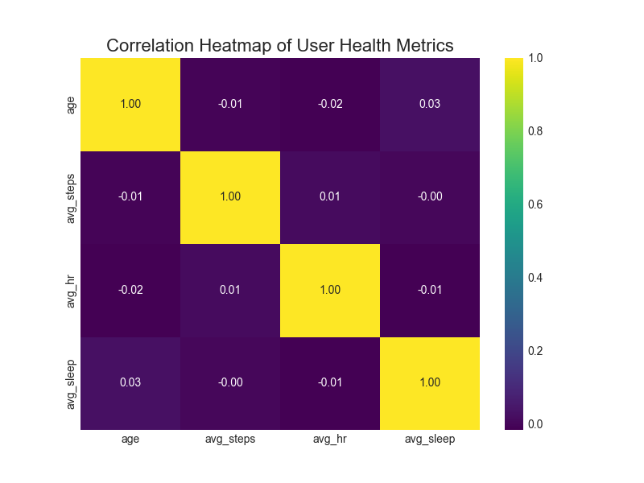
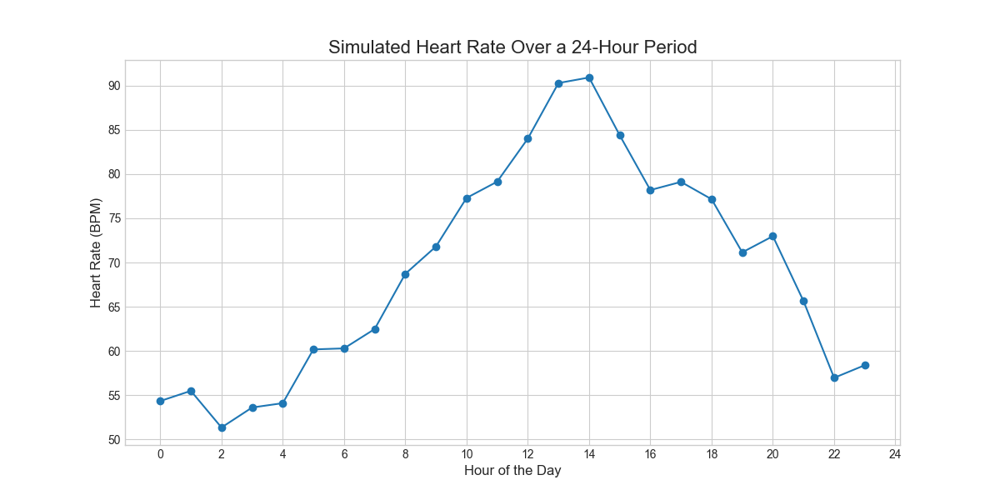
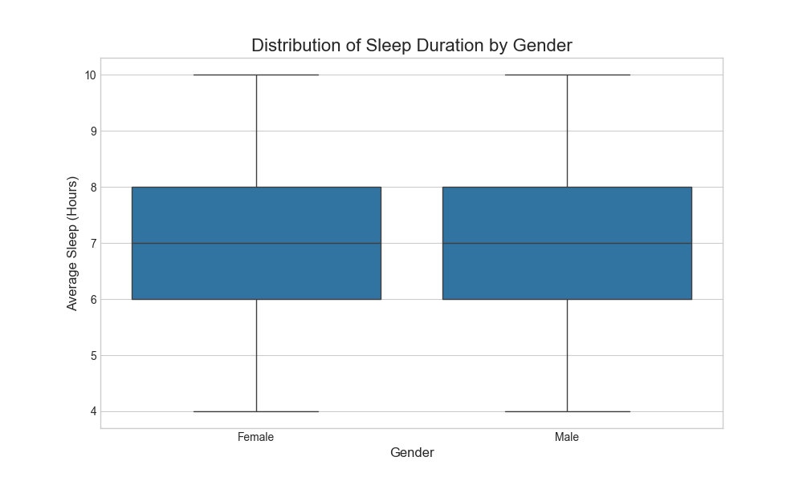
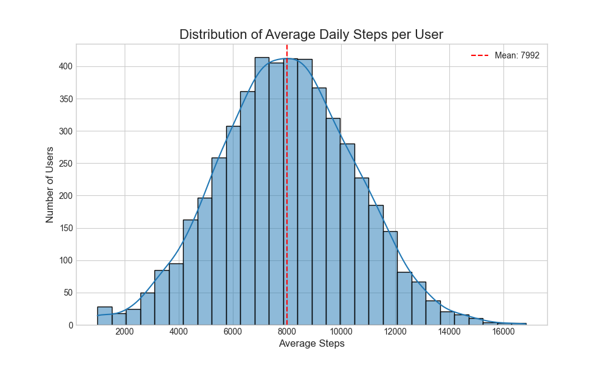

Health Recommender Project
This repository contains the source code for a capstone project that demonstrates how to build and evaluate a suite of machine learning-based recommender systems for personalised health monitoring. The system analyses simulated user health data (steps, heart rate, sleep) to provide tailored health tips.

🛠️ Technologies Used
- **Language:** Python
- **Libraries:** Pandas, NumPy, Scikit-learn
- **Data Analysis:** Jupyter Notebooks
- **Visualization:** Matplotlib, Seaborn

🚀 Features
- Analyzes user data (steps, heart rate, sleep).
- Provides personalized health recommendations.
- Implements both Content-Based and Collaborative Filtering models.

⚙️ Installation

Clone the repository:
   git clone [https://github.com/Vatsalsamarth/health-recommender-project.git](https://github.com/your-github-username/health-recommender-project.git)
   cd health-recommender-project

▶️ Usage
To run the recommender system and get a health tip for a specific user, execute the main script from your terminal.

python3 src/main.py --user_id 123

📄 License
This project is distributed under the MIT License. See `LICENSE` for more information.

